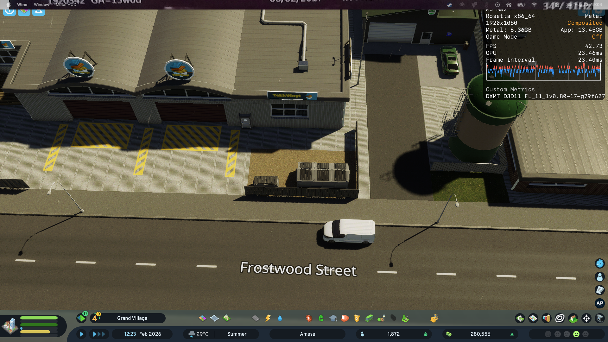
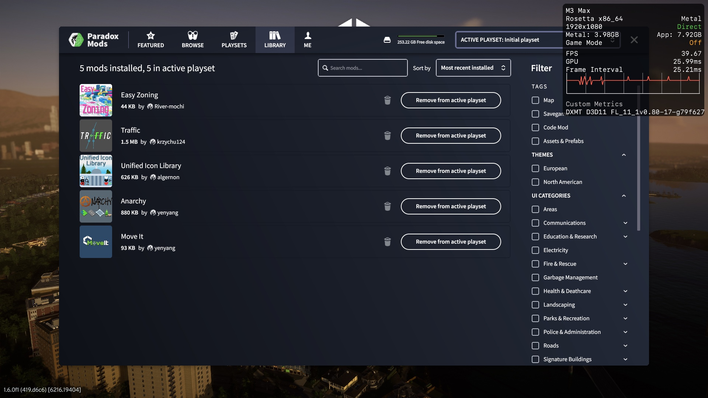

# Cities: Skylines II on macOS (Apple Silicon) — free, no CrossOver

Field notes from getting **Cities: Skylines II** running on an **M3 Max / macOS 26**, on a
fully free stack, **including working in-game Paradox Mods downloads** — which was the hard part
and, as far as I can tell, isn't documented anywhere else.

**Status (2026-08-23):** Playable. Renders, saves, mods download *and* load — and the last
real defect (the alt-tab / exclusive-fullscreen freeze) is **fixed** by an optional self-built
stock wine 11.16 engine ([INSTALL §6](INSTALL.md#6-recommended-build-the-wine-1116-engine-kills-the-alt-tab-freeze)):
~45 FPS, Direct presentation, freeze gone.



*The game on macOS 26 (M3 Max), x86-64 under Rosetta, rendering through Metal via DXMT — 42.7 FPS
at 1080p on the Wine 11.0 stack; the 11.16 engine measures 44.9 FPS at the same settings. The
overlay is Metal's own performance HUD, enabled with `CS2_HUD=1`.*

## Quick start

Own the game on Steam, on an Apple Silicon Mac? Roughly 20 minutes:

```bash
git clone https://github.com/macgameport/cities-skylines-2-macos.git
cd cities-skylines-2-macos
bash scripts/setup.sh
```

`setup.sh` checks your prerequisites, applies the patches, and builds a double-clickable app with
the game's own icon. You need a Wine wrapper with Steam and the game inside it first —
**[INSTALL.md](INSTALL.md) walks through all of it**, including the one in-game setting worth
changing (Display Mode → Fullscreen Window).

## The stack that works

Two stacks work. The **Wine 11 + DXMT** one is the default since 2026-08-22 because it needs
**10 patches instead of 17** — Wine 11 fixed both the Mono garbage-errno defect *and* the bcrypt
signature defect upstream ([the measurement](docs/wine-bugs/FINDING-wine11-fixes-it.md)).

| Layer | Default — **self-built Wine 11.16 + DXMT** | Base — **Wine 11.0 + DXMT** | Fallback — **Wine 10 + D3DMetal** |
|---|---|---|---|
| Wrapper | the Porting Kit bundle, engine swapped | Porting Kit app bundle | Kegworks / WineskinNavy bundle |
| Wine | **stock 11.16**, built by [`scripts/build-engine-1116.sh`](scripts/build-engine-1116.sh) | **Wine 11.0** (`WS12Wine11.0_DXMT-v0.80`) | **Wine 10.0 Sikarugir** |
| Graphics | **DXMT v0.80** (reused from the base engine) | **DXMT v0.80** — reports the real GPU | **D3DMetal v2.1** — reports `AMD Compatibility Mode` |
| Patches | **10** | **10** — the 6 errno patches AND the licence bypass are unnecessary | **17** |
| Alt-tab in exclusive fullscreen | **works** | freezes ([dxmt#206](https://github.com/3Shain/dxmt/issues/206)) — use borderless | mild misbehaviour |
| Steam's **visible storefront** | **renders** with patched wine+DXMT (2026-08-31); **black** on the stock stack — shop via **CS2 Steam Store.app** | **renders** | renders |
| Measured | **44.9 FPS**, GPU 23.1 ms, presentation `Direct` | 42.7 FPS, GPU ~26 ms, `Composited` | — |
| Proven by | a full validated session: mods delete+redownload, alt-tab cycles, city play | boots, mods load + download, Steam UI, DLC | a 1h40m session, saved city, long-run stability |

The 11.16 engine is the recommended setup and takes about an hour to build ([INSTALL §6](INSTALL.md#6-recommended-build-the-wine-1116-engine-kills-the-alt-tab-freeze)).
It needs the Wine 11.0 + DXMT stack installed first — it reuses that engine's DXMT binaries and
x86_64 support libraries, and redistributes nothing.

Both run CS2 `1.6.0f1 (419.d6c6)` via Steam in-prefix at `Direct3D 11.0 [level 11.1]` — no MoltenVK
device-loss lottery, no OpenGL. The one serious defect — an alt-tab "freeze" in exclusive
fullscreen — was diagnosed here, reproduced in a standalone ~150-line program, and reported
upstream as [dxmt#206](https://github.com/3Shain/dxmt/issues/206) (presents to an HWND's
non-newest swapchain are silently never composited; the game keeps running at full speed while
the screen shows a stale frame). **It does not affect Fullscreen Window (borderless) mode**, and
even a frozen exclusive-mode session is recoverable in-game — full story in `GOTCHAS.md` § alt-tab
and `docs/dxmt-bugs/`.

> An earlier attempt on **Wine 11 + DXVK + private-API MoltenVK** also rendered, but device-lost
> roughly 1 run in 8 — playable by dice roll. D3DMetal is stable. Notes kept in `archive/`.

## Three things worth knowing before you start

1. **Launch `Cities2.exe` directly.** Steam's *Play* button routes through the Paradox Launcher
   and exits before Unity initialises. Start Steam, let it log in, wait for the licence to sync,
   *then* run the exe.
2. **Set Display Mode to Fullscreen Window (borderless).** It looks identical to exclusive
   fullscreen, routes mouse and keyboard correctly, and is immune to the alt-tab freeze
   ([dxmt#206](https://github.com/3Shain/dxmt/issues/206)). Avoid `explorer /desktop=` (it eats
   WSAD — keyboard goes to the virtual-desktop container) and avoid exclusive Fullscreen unless
   you never switch apps — and if it does freeze there, alt-tab refreshes the screen one frame
   per cycle, so you can blind-navigate Options → Graphics → Display Mode → Fullscreen Window
   and it comes back live. No force-kill needed.

3. **Steam's storefront window is black on the *stock* 11.16 engine — the game is unaffected.**
   The daily flow runs Steam in tray mode (`-silent`), which is all CS2 needs: login, licences,
   Paradox Mods downloads all work normally. What does not render is Steam's *visible* UI —
   the store, library and settings windows.
   ✅ **SOLVED 2026-08-31 with local patches to wine + DXMT** — the client now renders completely,
   out-of-process, no shim, 0 GPU crashes. Root cause: `_CreateMetalViewFromHWND` dereferences a NULL
   from `get_win_data()` for a cross-process child window, and wine's existing remote-layer route was
   never wired up. Full write-up: [`docs/steam-ui-findings.md`](docs/steam-ui-findings.md);
   state per cell: [`docs/test-matrix.md`](docs/test-matrix.md).
   ✅ **Resize fixed the same day** — two more bugs, both in the hosting layer, both measured rather
   than guessed at: a **one-device-pixel white seam** (retina halves an *odd* Win32 pixel size to a
   `.5` point, so the layer lands a pixel short of a whole-point content view — the odd axis is the
   axis that shows it), and a **blackout** caused by hosted layers stacking in *creation* order
   instead of Win32 paint order, which put a full-window layer over the content on any resize that
   recreated the lower of Steam's two sibling CEF browsers. Now: 0 seams across 20 captures, and the
   sequence that used to black the client out permanently renders throughout.
   ✅ **A third blackout, found in real use minutes later** — navigating to the Library turned the
   client black. CEF collapses the inactive browser to **0×0** while keeping it in the z-order, and
   an empty rect was being read as "no rect supplied" and stretched over the whole view. Fixed;
   six-navigation sweep clean. Note what this says about the testing: the scripted suite drove
   *geometry* and never drove *content*, so it could not have found it.
   ⚠ Still untested: **flicker during a live mouse drag** — a post-settle capture cannot see a
   sub-frame flash either way. And content-driven states beyond one `steam://` sweep (overlays,
   popups, the in-game overlay) have not been tried. And the patches are **not** upstreamable as-is: dxmt's
   `CONTRIBUTING.md` forbids AI-authored PRs, so this goes upstream as a findings report, not a
   patch.
   **The patches are public and anyone is welcome to them** —
   [`winemac-crossprocess-remote-layer.patch`](scripts/winemac-crossprocess-remote-layer.patch)
   (wine half) and [`dxmt-remote-layer-fallback.patch`](scripts/dxmt-remote-layer-fallback.patch)
   (DXMT half); neither works alone. Each carries an AI-authored header so a maintainer can make
   an informed choice before reading, because the upstream report deliberately contains the
   diagnosis and none of the code.
   The original upstream limitation ([dxmt#141](https://github.com/3Shain/dxmt/issues/141)) is that
   Steam's CEF asks for a swapchain on a window owned by another process, which stock DXMT cannot
   serve,
   and Chromium's software fallback fails the same way.

   **The storefront still works — from the second app.** The engine build (INSTALL §6)
   preserves your wine 11.0 wrapper as `CS2dxmt11-pk110.app` (an APFS clone: under a minute,
   ~no extra disk, the game install stripped from the clone) and installs **CS2 Steam
   Store.app** beside the game shortcut. Double-click it to buy DLC or browse; **Steam
   licences are account-level**, so a purchase there is immediately playable in the game
   wrapper. Built the engine before this existed? `bash scripts/make-steam-shortcut.sh`
   retrofits both pieces. (Or just use another device, or the Steam website.)

   One account holds one online session (measured 2026-08-24): opening the store while the
   game is running steals the session from the game's Steam — **the running game does not
   care** (8-minute soak, zero errors) — and the next game launch takes the session back,
   dropping the store to its cached/offline view. Swap freely; nothing breaks.

   *Measured, so you don't retry them:* Steam filters `--in-process-gpu` and `--disable-gpu`
   from its own command line (`--use-angle` does forward). Injecting `--in-process-gpu` at
   steamwebhelper via a shim (`scripts/install-webhelper-shim.sh`) **does** make the window
   render — but Chromium then draws no text at all, so it is not a usable workaround today.
   ⚠ **The "no text" half is under retraction (2026-08-30).** Those runs had no font library at
   all — wine could not resolve `libfreetype.dylib`, printed one line and carried on with no font
   backend, which renders art and no glyphs on its own. The shim was also installed in a `cef` dir
   Steam never launches, so the switches never reached CEF. Read [`EXPERIMENTS.md`](EXPERIMENTS.md)
   before building on any of it; the *rendering* half stands. Out-of-process the GPU process
   crash-loops on **every** ANGLE backend (default / `gl` / `vulkan`). And running the Steam
   client on **vanilla wined3d** while the game keeps DXMT — the split verified landing via
   `+loaddll` — leaves the window black at the *same byte size* on both wined3d renderers, so
   the storefront's failure was never DXMT's missing cross-process swapchain; it is the winemac
   presentation layer. Apparatus kept as `scripts/steam-vanilla-d3d-split.sh` +
   `scripts/steam-render-cell.sh`. Details in [GOTCHAS.md](GOTCHAS.md).

## Repository layout

| Path | What |
|---|---|
| `INSTALL.md` | **Start here to play.** Step-by-step from nothing to a working game |
| `docs/patch-inventory.md` | All 17 binary patches, the bug each works around, and which upstream owns it |
| `GOTCHAS.md` | Every trap hit, with root cause. Sections carrying a `> **Ledger:` banner have been audited — read it, some conclusions are withdrawn |
| [`docs/steam-ui-findings.md`](docs/steam-ui-findings.md) | **Start here for the Steam-UI thread** — the two bugs as one causal story, what is eliminated, what is open |
| `EXPERIMENTS.md` | **What we tested, under what config, and how much to trust it.** Conclusions register + run index. Read this before designing a test or citing a result |
| `docs/agent-brief.md` | One-screen brief for subagents, which inherit none of the project context |
| `CONFIG-TRIALS.md` | Config permutations tried, with outcomes (historical — the old DXVK stack) |
| `MODS-TESTING.md` | The Paradox Mods download investigation |
| `REFERENCES.md` | Upstream projects, recipes, sources |
| `PLAN.md` | Roadmap / open threads |
| `launchers/` | The one live launcher; dead-stack scripts archived with reasons |
| `scripts/` | Minimal reproducers, `make-shortcut.sh` (builds the double-clickable launcher app — icon extracted from your own `Cities2.exe`, plus a persistent progress window for the Steam/licence wait), and the helpers the launcher runs each boot: `cs2-display-profile.sh` (per-display retina/DRS profile) and `patch-modconflict-badge.py` (removes the mod keybinding ⚠ badges) — see `scripts/README.md` |
| `patches/` | The 16 publishable binary patches + `repatch.sh`. The Wine 11 path needs 10 of them, **all present** |
| `docs/wine-bugs/` | Ready-to-file Wine bug reports for the three root causes |

> **Wine 11 needs 10 patches, and all 10 are here.** ✅ **R3 is fixed upstream** (measured
> 2026-08-22): with the Coherent Gameface licence bypass fully removed, wine-11.0 verifies the
> ECDSA signature correctly and the game reaches the main menu and loads a city with zero licence
> errors. So the one patch this repo withholds — a signature-check bypass, withheld because
> publishing one reads as circumvention regardless of intent — **is not needed on the default
> stack**. It remains necessary on the Wine 10 + D3DMetal fallback, which is therefore the
> incomplete path here (16 of its 17). See `docs/wine-bugs/R3-*.md`. No game or middleware binary
> is redistributed.

## The real finding: the bug is real, and Wine 11 already fixed it



*The part no other Mac guide has managed: the in-game Paradox Mods manager, working — five mods
installed, downloaded and active in-game. This is what the patches below make possible.*

The patches exist because of a genuine defect — but **not the one first assumed**, and it is fixed
upstream. Measured 2026-08-22, same probe under Unity's Mono with a **pristine** `mscorlib`:

| | wine-10.0 | wine-11.0 / 11.15 |
|---|---|---|
| `Marshal.GetLastWin32Error` after P/Invoke | **1525694624 (garbage)** | **0** |
| `Directory.Delete(recursive)` | throws `IOException 0x5af040a0` | OK |
| `File.Delete(nonexistent)` | throws | OK |

**On Wine 11, 7 of the 17 patches become unnecessary** — the six errno-tolerance ones plus the
licence bypass — each verified by running the game with them removed: it boots, mods load, a
**fresh mod download completes** with zero IO errors, and the main menu is reached with zero
licence errors.

Two things this project got wrong first, both disproven by measurement and documented in
[`docs/wine-bugs/`](docs/wine-bugs/):

- **It is not raw Win32.** Bug [60220](https://bugs.winehq.org/show_bug.cgi?id=60220) was filed
  against `kernel32` and closed INVALID: `GetLastError` is **9/9 correct** on both Wine versions
  (`scripts/errtest.c`). The corruption is in **Mono's P/Invoke last-error capture**.
- **`CreateFile` never returns handle 0.** 3200 concurrent opens, short and long paths, both Wine
  versions — never once (`scripts/handletest.c`, `scripts/longpathw.c`).

`patch_fshandle` is **still required on Wine 11** — the handle-0 defect and the garbage-errno defect
are separate bugs, and only the latter is fixed.

One bug is **not Wine's**: a leaked file lock in the Paradox SDK — a method with two `catch` clauses
and no `finally`, whose handler never releases the lock it took. Any IO exception leaks that path's
lock permanently. See [`docs/patch-inventory.md`](docs/patch-inventory.md) §5.

## Credit

This only works because of other people's free work:

- **[Paul the Tall / Porting Kit](https://www.portingkit.com/)** — supplied the missing piece: a
  Wine with `winemac.drv` Metal symbols exposed. **If this repo is useful to you, donate to them.**
- **[3Shain / DXMT](https://github.com/3Shain/dxmt)** — open D3D11→Metal; carried an earlier
  working stack
- **[Gcenx](https://github.com/Gcenx)** — the macOS Wine builds
- **Wineskin / Sikarugir / Kegworks** — the wrapper and engine lineage
- **[manolz1/cities2-gptk-fix](https://github.com/manolz1/cities2-gptk-fix)** and
  **mbeckenbach/Cities-Skylines-2-MacOS-Patcher** — the original DLL fixes
- **Apple** — D3DMetal

## Scope and legality

Notes and tooling for running **software you already own** on your own machine. No game binaries,
no middleware, no circumvention tooling is distributed here. Cities: Skylines II is © Colossal
Order / Paradox Interactive; Coherent Gameface © Coherent Labs; other marks belong to their owners.

See `LICENSE` (MIT, with an explicit third-party carve-out).
